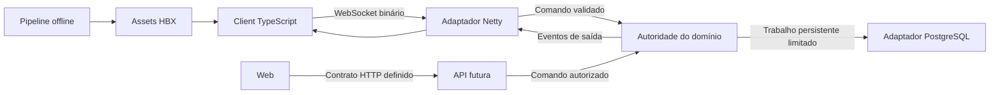

# Arquitetura Habbux v1

Status: **EARLY DEVELOPMENT / CORE NETWORKING v1**. Este documento registra
limites e direções aprovadas; não afirma que os sistemas de jogo já existem.

## Objetivo e restrições

Habbux é uma plataforma multiplayer independente. Código, protocolo, persistência
e assets de projetos anteriores não fazem parte desta fundação. A ordem de
prioridade é estabilidade, desempenho, otimização, baixa latência, concorrência,
uso responsável de CPU/RAM, manutenção, testes, observabilidade e escalabilidade.
Uma dependência ou abstração precisa resolver uma necessidade identificada.

## Componentes

| Limite | Responsabilidade | Situação nesta etapa |
|---|---|---|
| `apps/emulator` | Processo Java 25 autoritativo; rede Netty e futuros domínios | Listener WebSocket Core v1; sem gameplay |
| `apps/client` | Uma aplicação TypeScript/PixiJS para desktop, tablet e mobile | Codec, conexão Core e diagnóstico técnico |
| `apps/web` | Site e futuro acesso às APIs públicas | Projeto mínimo |
| `packages/protocol` | Fonte única do Habbux Protocol | Contrato Core v1 e vetores binários compartilhados |
| Contratos HTTP futuros | Necessidades públicas da Web | Sem serviço ou pacote até haver contratos e consumidores reais |
| Código compartilhado futuro | Utilidades puras com mais de um consumidor | Sem pacote vazio |
| `asset-engine` | Importação offline e produção de HBX | Pipeline conceitual documentado; sem conversores implementados |
| `database` | Evolução versionada da persistência PostgreSQL | Infraestrutura inicial; sem schema do hotel |
| `infrastructure` | Desenvolvimento, publicação e operação | Configuração isolada do projeto |

Contratos HTTP serão autenticados, versionados, validados e limitados; antes do
primeiro endpoint, definir erros, timeouts, idempotência quando necessária e
métricas. Alterações de saldo ou inventário continuam sob operações transacionais
do domínio, nunca em rotas Web que contornem o Emulator.

## Fluxo futuro de uma ação

O diagrama descreve uma arquitetura futura. Não pressupõe vários serviços em
execução: o Emulator é um monólito modular. HTTP começa como adaptador no processo;
runtime separado só será criado se operação ou carga justificarem a separação.
A Web não compartilha objetos, memória, tabelas internas por conveniência ou
referências mutáveis do Emulator.

## Direção das dependências

Bootstrap compõe configuração e adaptadores. Rede traduz bytes em comandos;
domínios decidem permissões e regras; persistência executa operações explícitas.
O domínio não importa classes Netty nem depende de um canal conectado para ser
testado. Protocolos de transporte não se tornam o modelo persistente.

Cada domínio só altera o estado que possui. Uma interação entre domínios usa
comandos/eventos ou operações transacionais definidas, sem acesso arbitrário aos
objetos internos do outro domínio. Não serão criadas interfaces para cada classe:
interfaces são úteis nos limites de relógio, aleatoriedade, rede e persistência.

## Dados, carga e falhas

PostgreSQL é a fonte persistente de verdade. RAM guarda o estado ativo autorizado.
Redis é opcional e efêmero. Filas, caches, payloads, trabalho por execução e
conexões precisam de limites explícitos. A saturação rejeita ou desacelera trabalho
conforme a classe da operação; não aumenta filas sem limite.

Operações econômicas confirmam sucesso após commit durável. Dados cuja perda seja
aceitável precisam de política documentada antes de persistência assíncrona.
Falhas parciais não autorizam repetição cega de compras ou concessão duplicada.

## Leitura por assunto

- [Emulator e limites de domínio](EMULATOR.md)
- [Rede e controle de carga](NETWORKING.md)
- [Concorrência dos quartos](ROOM-CONCURRENCY.md)
- [Dados e economia](DATA-ARCHITECTURE.md)
- [Client](CLIENT.md) e [multiplataforma](CLIENT-MULTIPLATFORM.md)
- [Assets](ASSET-PIPELINE.md)
- [Observabilidade](OBSERVABILITY.md), [erros](ERROR-MODEL.md) e [testes](TESTING.md)
- [Extensões e plugins futuros](PLUGINS.md)
- [Decisões arquiteturais](../adr/README.md)

Não há capacidade de jogadores demonstrada nesta etapa. Metas, riscos e critérios
de medição estão em [performance](../performance/PERFORMANCE-BUDGET.md).
